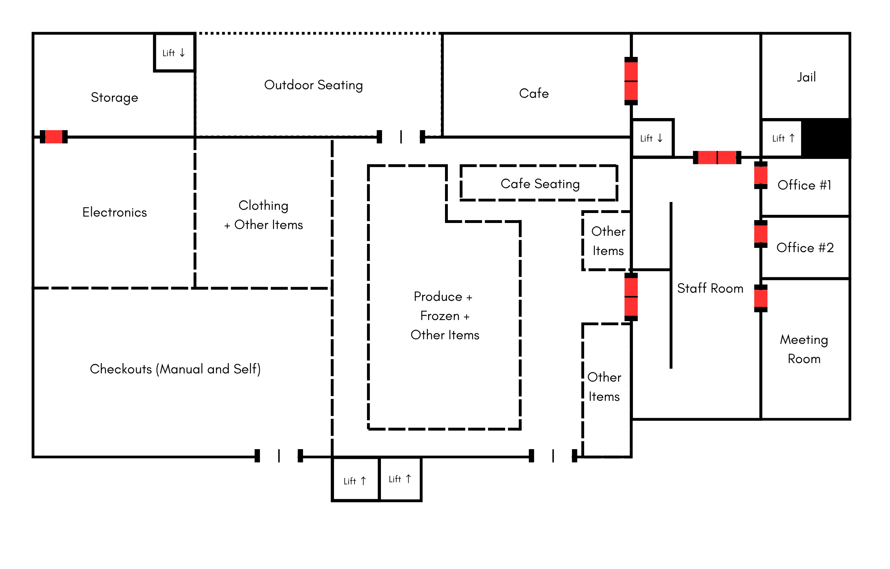
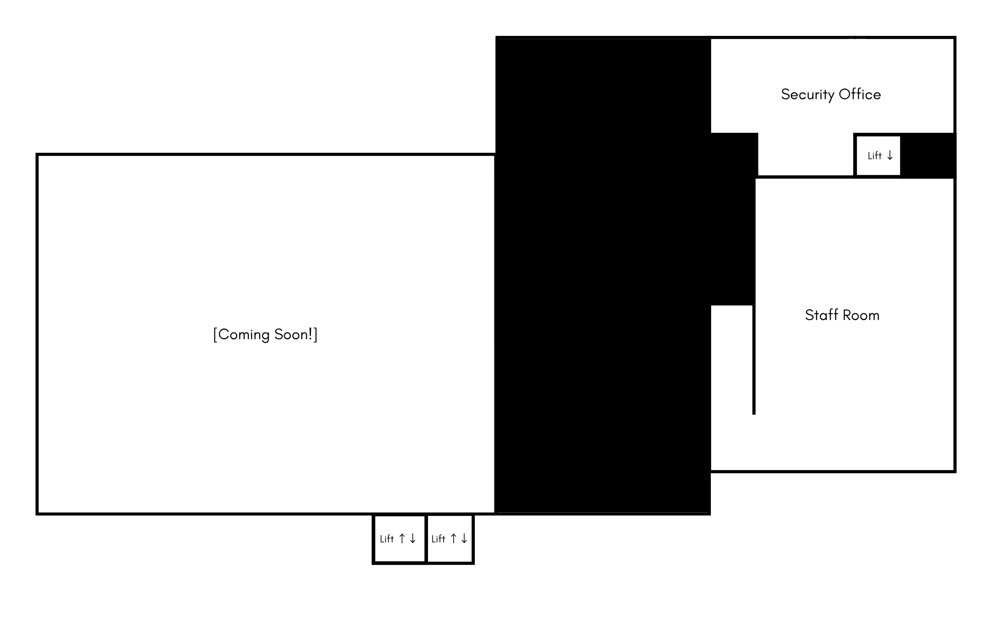
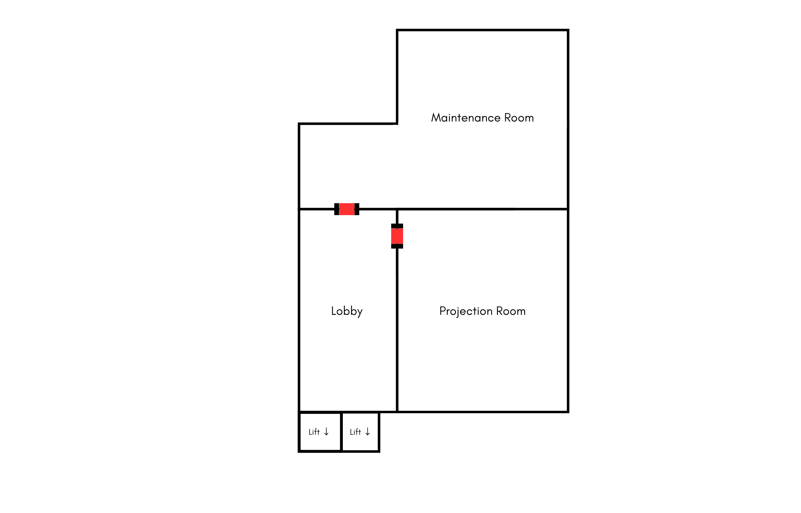

# Store Maps

:::info[Info]
Here you can find out the layout of each floors of the store.  
These maps will be updated when something in the store is changed.
:::

- Solid Lines signify walls.  
- Dotted Lines signify areas not separated by walls.  
- White Gates signifiy open access.  
- Red Gates signify limited access.  
- Lift Arrows signify where you can take the lift.  

:::note[Ground Floor]

:::

:::note[First Floor]

:::

:::note[Second Floor]

:::